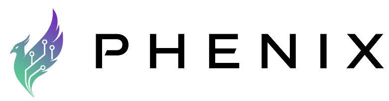

  <picture>
    <source media="(prefers-color-scheme: dark)" srcset="Phenix_Logo_Light.png">
    <source media="(prefers-color-scheme: light)" srcset="Phenix_Logo.png">
    
  </picture>

  <strong>The Trust Network for Decentralized Digital Identity</strong> 
  <em>An end-to-end identity platform for governments and enterprises — by <a href="https://iden2.com">iDen2</a>.</em>

  
  
  
  
  

---

### About

**Phenix** is an open-source, end-to-end digital identity platform built by [**iDen2**](https://iden2.com). It delivers sovereign, privacy-first identity infrastructure at national scale — supporting identity enrollment, verification, authentication, and lifecycle management within a unified, standards-compliant architecture.

iDen2's Trust Network is the backbone of Phenix, enabling enterprises, governments, and individuals to transact instantly, seamlessly, and securely through interoperable and monetizable digital identity.

---

### Standards and Compliance

Phenix is engineered around internationally recognized standards and regulatory frameworks:

- **W3C Verifiable Credentials 2.0** and **Decentralized Identifiers (DIDs)** for interoperable credentials
- **eIDAS 2.0** architecture for EU-compliant digital identity
- **ISO/IEC 24760** identity management framework
- **GDPR** data protection principles, privacy by design
- **DIDComm** for secure, asynchronous agent-to-agent communication
- **Zero-knowledge proofs** and selective disclosure for privacy-preserving verification

---

### Architecture

The Phenix ecosystem is built around four core components designed for end-to-end decentralized identity management:

<table>
<tr>
<td width="50%" valign="top">

**Agent Controller** | [`phenix-agent-controller`](https://github.com/phenix-id/phenix-agent-controller)

Orchestrates identity agents and manages their full lifecycle — from provisioning to credential exchange and interactions with external services.

</td>
<td width="50%" valign="top">

**Platform** | [`phenix-platform`](https://github.com/phenix-id/phenix-platform)

The core infrastructure and API layer powering the entire identity network. Handles schemas, credential definitions, connections, and organizational workflows.

</td>
</tr>
<tr>
<td width="50%" valign="top">

**Studio** | [`phenix-studio`](https://github.com/phenix-id/phenix-studio)

A modern web interface built with Astro and Tailwind for configuring, managing, and visualizing identity workflows — making decentralized identity accessible to non-technical users.

</td>
<td width="50%" valign="top">

**Mediator** | [`didcomm-mediator-credo`](https://github.com/phenix-id/didcomm-mediator-credo)

Facilitates secure, asynchronous communication between identity agents using the DIDComm protocol — enabling reliable message relay even when agents are offline.

</td>
</tr>
</table>

Built on [Hyperledger Aries](https://www.hyperledger.org/projects/aries) and [Credo](https://github.com/openwallet-foundation/credo-ts) frameworks for standards-compliant, interoperable decentralized identity.

---

### Get Involved

We believe identity infrastructure should be open, auditable, and community-driven. All of our core repositories are open source under the **Apache 2.0** license.

  
  

---

Phenix is a product of <a href="https://iden2.com">iDen2 Inc.</a> © 2026 Phenix-ID. All rights reserved.

